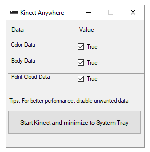
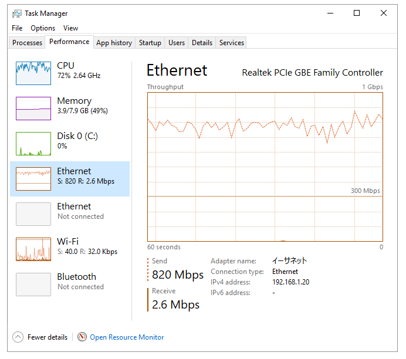

# kinect_anywhere
Kinect v2 for ROS while using Kinect Windows API

The application has following two parts, both need to be installed for using it-
1. [Windows](Windows)
1. [Linux](Linux)

## Windows
This application grabs data from Kinect v2 sensor using Kinect Windows API. Hence this must be run on Windows PC

## Linux
This is a ROS Package which gets the data from Windows application. The Linux PC is required to be connected to Windows PC using LAN.

## Dependencies
1. **Windows:** The dependencies are provided along with the pre-built binary. However, if you are planning to install from source, you need to have ZeroMQ v4.1.0.26 which can be setup using [nuget](https://www.nuget.org/packages/ZeroMQ/) inside Visual Studio
1. **Linux:** Please install ZeroMQ using the following command `sudo apt-get install libzmq3-dev`

## Installation
1. **Windows** 
     1. *Using pre-built binary:* The easiest way to run this windows application is to download the pre-built binary from [release page](https://github.com/ravijo/kinect_anywhere/releases). The URL of current version i.e., v3 is [here](https://github.com/ravijo/kinect_anywhere/releases/download/3/Kinect.Anywhere.Windows.v3.zip).
     1. *Compile source code:* In case if the above doesn't work, please compile the source code. You need to have Visual Studio Community 2017, which can be downloaded from [here](https://www.visualstudio.com/downloads/).
1. **Linux** 
     1. *Compile source code:* The Linux application is a ROS package. Hence you need to have ROS installed with a valid ROS workspace. Download the [linux](Linux) application and place it inside ROS workspace source folder i.e., `src`. Now, invoke catkin tool inside ros workspace i.e., `catkin_make`

## Steps to run
1. **Windows:** Simply double click on `Kinect Anywhere.exe`.

2. **Linux:** Invoke `kinect_anywhere.launch` with necessary parameters. `kinect_anywhere.launch` have following parameters:
     1. `color`: Boolean variable to enable color data
     1. `body`: Boolean variable to enable body tracking data
     1. `pointcloud`: Boolean variable to enable point cloud data
     1. `kinect_frame`: String variable to set frame id to above data
     1. `host`: String variable to set IP address of the Windows PC
     
     Below is an example of using `kinect_anywhere.launch` file:
     
     `roslaunch kinect_anywhere kinect_anywhere.launch  color:=true body:=true pointcloud:=true kinect_frame:=base host:=192.168.abc.xyz`

In order to save the value of `host` parameter parmanently, edit [kinect_anywhere.launch](Linux/kinect_anywhere/launch/kinect_anywhere.launch#L12) file

## Note
1. The Windows application is tested on 64Bit Windows 10, 8GB RAM, Intel Core i5-6200U 2.30GHz 2.40GHz CPU.
1. The Linux application is tested on [ROS Indigo](http://wiki.ros.org/indigo) in 64Bit Ubuntu 14.04.5 LTS, 8GB RAM, Intel Core i7-2600 3.40GHz x 8 CPU with kernel 4.4.0-59-generic and gcc 4.8.4.
1. The body tracking data can be visualized inside [Rviz](http://wiki.ros.org/rviz) by using [rviz_skeleton_visualization](https://github.com/ravijo/rviz_skeleton_visualization) package.
1. One of the major concerns while developing this tool was to receive the high quality of point cloud data in real-time. Hence, here in the development environment, Ethernet wire (CAT 6) in 1 Gbps LAN connection was used. The average data transfer speed (Color, Point Cloud, and Body Data are selected) was 800 Mbps approximately.

